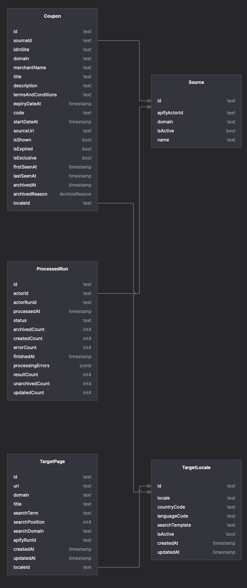

# Oberst Scrapers

This is a collection of scrapers for various websites. The scrapers are written in Typescript and use the Apify SDK.

## Code style

The code style is enforced using ESLint and Prettier. The configuration is in the `.eslintrc.js` and `.prettierrc.js` files.

Always open the project in Visual Studio Code from the root folder. The editor will automatically pick up the configuration and enforce the code style.

## Actor development

The scrapers are developed as Apify actors. The actors are located in the `packages` folder. Each actor is a separate package.

## API

The API is a separate package located in the `packages/api` folder. It is a server that:

1. Stores the scraped data in a database.
2. Provides an API for querying the data.
3. Provides an API for finding scrape targets.

### Storage

The database uses PostgreSQL. The database schema is located in the `packages/api/prisma/schema.prisma` file. The database is managed using Prisma. The following diagram shows the database schema:



### Querying

The API provides a REST API for querying the data. An OpenAPI docs server is started with the API. The OpenAPI docs are located at `/api-docs`.

### Scrape targets

Main concepts of the API include:

- Target locales - a list of locales that we are interested in scraping, e.g. `en_sg`, `fr_fr`, `ch_de`.

- Target pages - to obtain a list of pages to scrape, we run a search on Google for a given domain and locale, e.g. `nike.com coupon codes`, `nike.com промо кодове` and save the results.

- Sources - a source is a site that lists coupon codes. A scraper is created for each source.

- Coupons - the actual coupon codes.

## Development

To start developing, clone the repository and run `yarn` in the root folder. This will install all the dependencies.

To start the API, run `yarn dev` in the `packages/api` folder.

To start the actor, run `yarn start` in one of the actor folders.

Build the API docker image with `docker build -t oberst-scrapers-api -f docker/Dockerfile.api .`.
Run the API docker container with `docker run --env-file packages/api/.env -p 3000:3000 oberst-scrapers-api `.

Build the pipeline docker image with `docker build -t oberst-scrapers-pipeline -f docker/Dockerfile.pipeline .`.
Run the pipeline docker container with `docker run --env-file packages/api/.env -p 3000:3000 oberst-scrapers-pipeline`.

## Deployment

The actors are deployed to Apify. The API is deployed to DigitalOcean. The database is also hosted on DigitalOcean.

Deploying an actor must be done manually by running

```bash
scripts/deploy-apify.js <actor-id>
```

⚠️ The actor-id must be the same name as the folder in the `packages` folder.

## Workflow

The high-level workflow is as follows:

1. An external service triggers finding scrape targets, by calling the `/targets/find` endpoint of the API. The endpoint requires a `locale` parameter. For a given locale, we use an API to get a list of domains we are interested in scraping, e.g. `nike.com`, `adidas.com`.

2. For each domain, we run a search on Google for a given domain and locale, e.g. `nike.com coupon codes`, `nike.com промо кодове` and save the results.

3. Running target pages is done by calling the `/targets/run` endpoint of the API. This matches the target pages with the sources and runs the scrapers.

4. The scrapers are run on Apify. The results are stored in the database.
